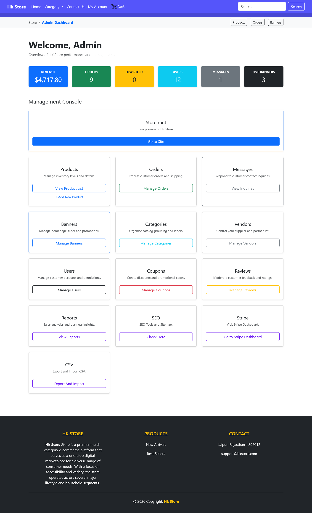
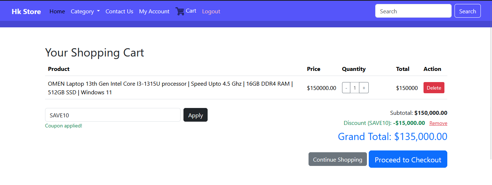
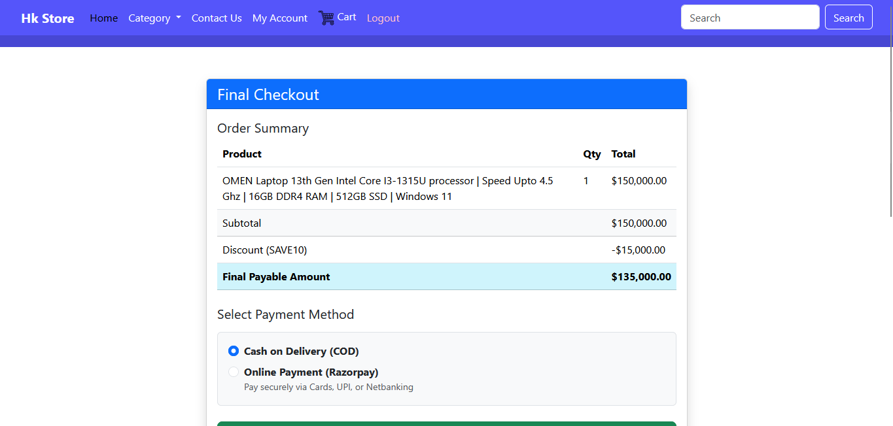
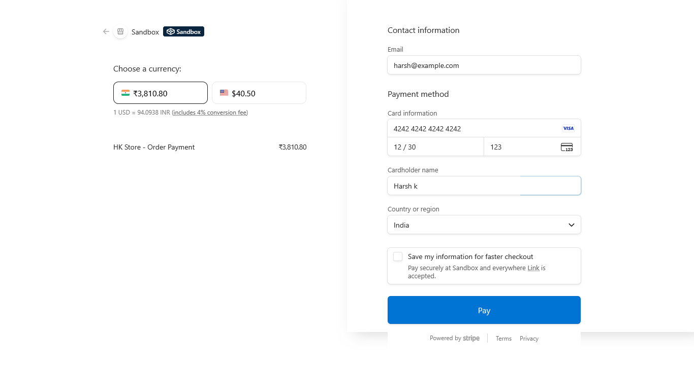

### Link : [http://ecoproject.infinityfree.me/](http://ecoproject.infinityfree.me/)

# Hk Store - Multi-Vendor E-commerce Platform

A custom-built PHP e-commerce system featuring distinct portals for Administrators, Vendors, and Customers. This project serves as a comprehensive demonstration of full-stack PHP development, focusing on session management, secure authentication, and relational database architecture.


<br>
**Disclaimer : I know putting Server Backend Files and Admin Credentials on Github (Publicly) can be Dangerous but still i did, removed DB credentials but if you still got any vulnerability please report to me.**

## 🚀 Live Demo

* **Primary Mirror:** [Github](https://github.com/Hk-Hacker-Harsh/Web_Projects/tree/main/ECommerce_Project)
* **InfinityFree Mirror:** [http://ecoproject.infinityfree.me/](http://ecoproject.infinityfree.me/)

---

## Test Credentials

You can use the following accounts to test the different access levels and functionalities of the platform.  
**Default Password for all following accounts:** `password`

### 👤 Customer Accounts
* `customer@ecoproject.com`
* `customer1@ecoproject.com`
* `customer2@ecoproject.com`
* `customer3@ecoproject.com`
* `customer4@ecoproject.com`

### 🏪 Vendor Accounts
* `vendor1@hkstore.com`
* `vendor2@hkstore.com`
* `vendor3@hkstore.com`

### 🛠 Admin Account
*  `harsh@example.com`
* `admin@ecoproject.com`

---

## 🌟 Key Features

### User Portals
* **Customer Dashboard:** Personal profile management, real-time order history tracking, and itemized digital receipts.
* **Vendor Panel:** Dedicated inventory management system allowing vendors to process orders and manage products specific to their shop.
* **Admin Console:** Global oversight featuring revenue analytics, user role permissions, inventory control, and a centralized contact inquiry hub.

### Technical Implementation
* **Secure Authentication:** Password protection using Bcrypt hashing and logical session-based routing to prevent unauthorized access.
* **Database Architecture:** Relational mapping that automatically links shopping cart sessions to permanent order and item records.
* **Clean UI:** Responsive design built with Bootstrap 5, featuring interactive elements powered by JavaScript and jQuery.

## 🛠 Tech Stack
* **Backend:** PHP (Procedural)
* **Database:** MySQL
* **Frontend:** Bootstrap 5, CSS3, JavaScript (jQuery)
* **Hosting:** InfinityFree

## 📂 Project Structure
* `/admin` - Administrative management logic and dashboard.
* `/vendor` - Vendor portals and shop-specific management.
* `/includes` - Core reusable components (Header, Footer, Session Logic).
* `/stripe-php` - Strpie Official Php Integration.
* `/Assets` - Product media and site assets.
* `db.php` - Database connection and configuration.
* `Database&DummyData.sql` - Complete database structure and dummy data for easy replication.

## ⚙️ Setup Instructions

1. **Clone the Repository:**
   ```bash
   git clone https://github.com/Hk-Hacker-Harsh/Web_Projects.git
   ```
    - Use ECommerce_Project
    
2. **Database Configuration:**
    - Create a MySQL database (e.g., hk_store).

    - Update [db.php](./htdocs/db.php) with your original DataBase Credentials.

    - Import the Database&DummyData.sql file to generate tables and dummy data.

3. **Deployment:**
    - Update Stripe API Key (Secret_key) in [process_checkout.php](./htdocs/process_checkout.php), [process_payment.php](./htdocs/process_payment.php), and [success.php](./htdocs/success.php).

    - Move the contents of the htdocs folder to your local server directory (e.g., XAMPP htdocs) or your live hosting public directory.

## Files
```
ECommerce_Project
    |
    │   Database&DummyData.sql
    │   htdocs.zip
    │   README.md
    │
    ├───htdocs
    │   │   .htaccess
    │   │   add_to_cart.php
    │   │   cart.php
    │   │   checkout.php
    │   │   contact.php
    │   │   db.php
    │   │   index.php
    │   │   logout.php
    │   │   order_details.php
    │   │   process_checkout.php
    │   │   process_payment.php
    │   │   product.php
    │   │   product_details.php
    │   │   profile.php
    │   │   robots.txt
    │   │   signin.php
    │   │   signup.php
    │   │   sitemap.xml
    │   │   success.php
    │   │   t&c.php
    │   │   toggle_wishlist.php
    │   │   update_cart.php
    │   │   wishlist.php
    │   │
    │   ├───admin
    │   │       add_category.php
    │   │       add_product.php
    │   │       admin_auth.php
    │   │       categories.php
    │   │       contact_messages.php
    │   │       coupons.php
    │   │       dashboard.php
    │   │       data_management.php
    │   │       edit_product.php
    │   │       export_handler.php
    │   │       index.php
    │   │       manage_banners.php
    │   │       manage_reviews.php
    │   │       orders.php
    │   │       products.php
    │   │       reports.php
    │   │       seo_tools.php
    │   │       users.php
    │   │       vendors.php
    │   │
    │   ├───api
    │   ├───Assets
    │   │   │   bootstrap.bundle.min.js
    │   │   │   bootstrap.min.css
    │   │   │   jquery.min.js
    │   │   │   shopping-cart.png
    │   │   │
    │   │   ├───avatars
    │   │   │       user_4_1770049618.jpg
    │   │   │
    │   │   ├───Banners
    │   │   │       1.png
    │   │   │       1770047495_1.png
    │   │   │       1770047516_2.png
    │   │   │       1770047524_3.png
    │   │   │       2.png
    │   │   │       3.png
    │   │   │
    │   │   └───upload
    │   │           1769860587_four.jpg
    │   │           1769860647_four.jpg
    │   │           1769882083_three.jpg
    │   │           1769916413_lap.jpg
    │   │           1769916548_lap2.png
    │   │           1769917646_fas1.jpg
    │   │           1769917709_fas2.jpg
    │   │           1769917872_fas3.jpg
    │   │           1769918399_PS.jpg
    │   │           1769918544_fru1.jpeg
    │   │           1769918603_fru2.jpeg
    │   │           1769918776_veg1.jpeg
    │   │           1769918879_veg2.webp
    │   │           1769919056_hobb1.png
    │   │           1769921593_acc1.jpg
    │   │           1769921767_learn1.jpg
    │   │           1769921941_other1.jpg
    │   │           1770095516_coffee.jpg
    │   │           1770095598_tshirts.webp
    │   │           1770095619_smartphone.jpg
    │   │           1770095633_laptop.jpg
    │   │
    │   ├───includes
    │   │       dashboard_nav.php
    │   │       footer.php
    │   │       header.php
    │   │       session.php
    │   │
    │   ├───stripe-php (Stripe File from https://github.com/stripe/stripe-php/tree/master)
    │   │
    │   └───vendor
    │           add_product.php
    │           dashboard.php
    │           edit_product.php
    │           index.php
    │           login.php
    │           orders.php
    │           order_details.php
    │           products.php
    │
    └───Screenshots
            1.png
            2.png
            3.png
            4.png
            5.png
            gif.gif
```
## Screenshot
### Home Page


### Admin Panel


### Cart


### Checkout


### Stripe Integration



## 📝 Disclaimer

This project was developed for educational purposes to test and showcase full-stack PHP development skills.
